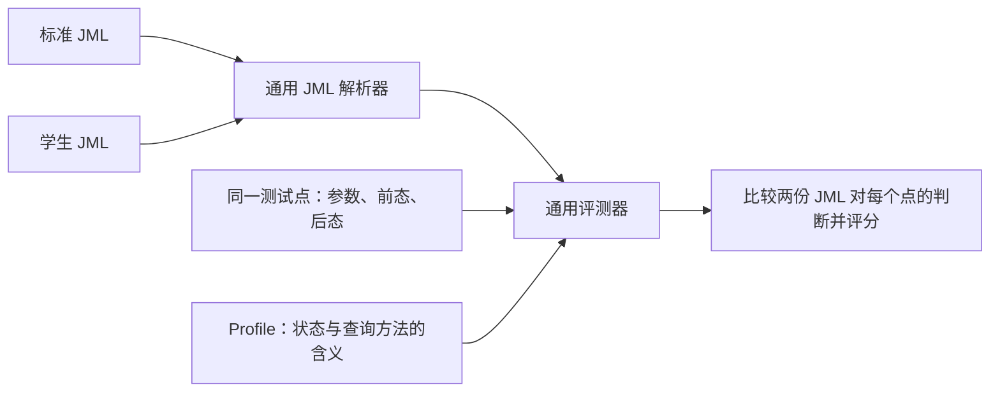

# 0828 Report（当前实现状态已补充）

## 工具调用流程

1. 课程组先写完整、准确的 JML；
2. 为每道练习写两份元信息：
   1. `requirement.md`：学生读到的自然语言需求
   2. `blank_plan.json`：决定完整 JML 中挖空的位置，并记录每个空位考察的知识点
3. 为方法选择或新增评测 Profile，并在 `suites/<类名>/<方法名>/` 建立 `suite.yaml`、`points.yaml` 和参考 JML。Suite 指定方法参数、合同形状、区域权重、诊断和测试点文件；同一领域的新方法通常不需要修改评测核心。
4. 用 `validate_suite.py` 检查 Suite 配置、参考合同和所有声明测试点，再用正确和故意错误的 JML 各评测一次。存活变异要人工判别：有些与参考合同在合法状态内等价，不能直接算作漏测。
5. `blank_plan.json` 经人工确认并标为 `teacher_approved` 后，执行 `publish-exercise --semantic-suite <suite.yaml>`。该确定性命令在一个新的 `exercises/<题目名>/` 下自动生成：
   1. `template.java`：由完整 JML 按挖空计划替换出的学生模板
   2. `requirement.md`：复制后的学生题面
   3. `exercise.json`：从上述输入自动派生并绑定 Suite 的 Web 配置
   4. `samples/`：公开样例目录。
6. 发布。学生填写答案，提交后得到反馈：
   1. 正确性评测由脚本完成，不依赖 LLM，保证可解释性
   2. LLM 根据脚本返回的结果生成指导意见。

## 一致性评测

LLM 不参与评测，保证评测可解释和正确。  

参考 JML 不传递给 LLM，可降低答案泄漏风险；提示词注入仍需单独防护。

当前已经实现通用 Profile 边界。Profile 只负责：参数与调用的静态类型、白名单查询函数的解释、抽象状态加载和状态合法性；领域无关 core 负责 JML AST、行为合同归一化、测试点比较与计分。

测试点可逐条书写，也可由 `generators` 对声明的参数域、前态和后态做确定性笛卡尔展开。完整参考 JML 是 oracle，测试点不重复保存“正确答案”。当前通过只保证声明有限域内一致，不等价于数学意义上的全状态证明；可选 SMT 审计／强制模式和确定性变异测试已实现，但都只覆盖已建模的 JML 子集。`unfollowUser` 当前变异识别率为 6/7；剩余变异在 `network_v1` 合法状态中等价，不代表学生成绩或必然的测试点缺口。

评测脚本据此验证学生填写结果和正确 JML 在有限测试域内是否一致，并返回格式化结果（JSON）。结果包含区域覆盖权重、Profile、suite 版本、保证范围和学生源码行；LLM 只接收脱敏后的诊断、学生提交和题干。

## 回答若干问题

### 错误类型

| 层 | 错误代码/类别 | 含义 |
| --- | --- | --- |
| 结构检查 | `UNFILLED_BLANKS` | 还有 `{{...}}` 空位 |
| 结构检查 | `FRAMEWORK_CHANGED` | 接口签名、行为框架或锁定部分被改动 |
| 结构检查 | `EMPTY` | 提交为空 |
| 结构检查 | `STRUCTURE_OK` | 信息，不是错误；格式可进入语义检查 |
| 语义评测 | `NORMAL_CONDITION_MISMATCH` | `requires` 与参考规格不等价 |
| 语义评测 | `POSTCONDITION_MISMATCH` | `ensures` 在某个抽象前后态中不等价 |
| 语义评测 | `EXCEPTION_PARTITION_MISMATCH` | `signals` 的异常类型、条件或优先级不正确 |
| 语义评测 | `LOCKED_CLAUSE_CHANGED` | `assignable` 或锁定输出规格被改动 |
| 语义评测 | `JML_FORMAT_OR_SYMBOL` | JML 解析失败、使用未支持/不存在的符号、子句数量不符合当前 Demo 约束等 |
| 服务异常 | `JUDGE_CONFIGURATION` | 服务器缺少参考 JML 或评测脚本 |
| 服务异常 | `JUDGE_UNAVAILABLE` | 调用评测脚本失败或超时 |
| Agent 兜底 | `Agent 反馈格式异常` | LLM 没有按 JSON 契约返回；不影响确定性结果 |

### 反馈类型

1. 第一个错误位置
2. 需要注意
3. 下一步

### JML 在评测中起的作用

- 特殊评测点？
  - 统一评测 Java 和补全的 JML
- 两阶段评测中的第一阶段？
  - 第一阶段发布挖空的官方包，由学生填写 JML 后评测
  - 第二阶段学生根据自己补全的 JML 完成 Java
- 上机实验？

---


# 0916 Report

## JML 一致性评测

目前确立的方法是数据点评测，具体规则如下：

1. 准备一个正确实现的 JML
2. 准备一份 Profile。Profile 包括 JML 中要使用的方法的具体定义
3. 准备待评测的 JML
4. 准备数据点。数据点包括：
   - 前态：比如 userId，user1 关注 user2 等
   - 后态：比如 user2 也关注了 user1 等
5. 评测：对于同一个前后态测试点，如果正确 JML 和待评测 JML 结果一致，则认为通过

> 即，可以构造一些错误的前后态，要求两个 JML 均不通过；构造一些正确的前后态，要求两个 JML 均通过


现已可以通过写 YAML 的形式在 `NetworkInterface` 范围内出新题。

## Profile 与评测

1. 从参考 Java 和学生 Java 中找到目标方法前的 JML 块。
2. 解析 `requires`、`ensures`、`signals` 和 `assignable`
3. 选择 Profile 和测试点
4. **Profile 将 JML 方法调用解释为抽象状态查询**
5. 在相同测试点上分别计算参考子句和学生子句
6. 真值不一致时产生确定性诊断，并按“区域权重 × 测试点通过比例”计分



Profile 具体来说是用 Python 实现了 JML 中会出现的方法（比如 `containsUser`）并规定它们的含义。评测器对每个方法询问 Profile 获取语义，计算真值，最后出结果。

## 评测推送前端

新题可以方便推到前端。

```bash
cd Agent

python3 -m hw9_agent web --exercise-dir exercises/unfollow_user --host 127.0.0.1 --port 8000
```